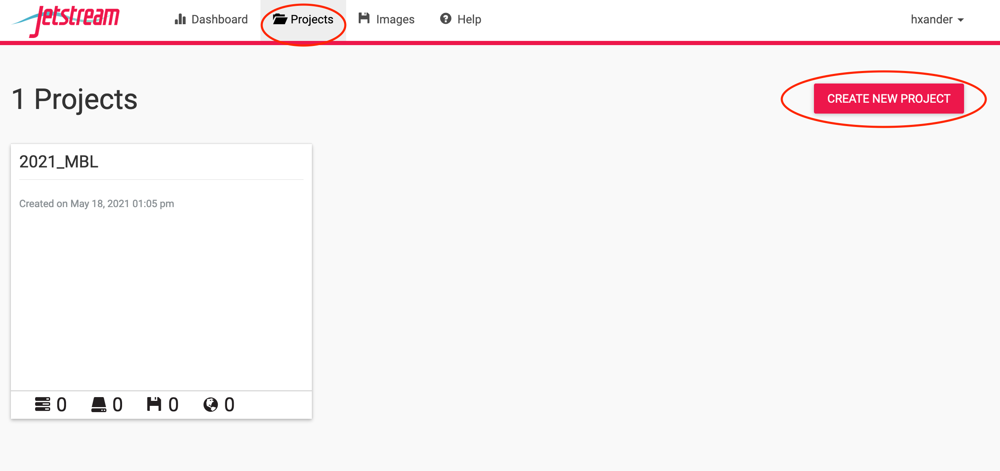
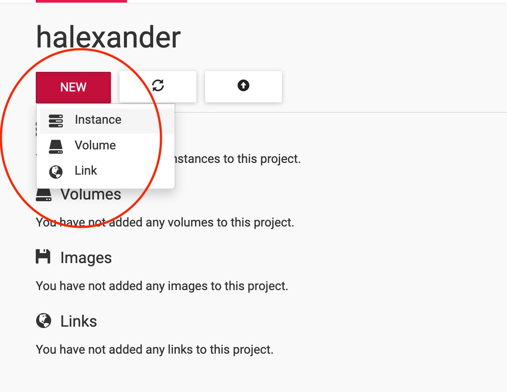

# 2021 MBL Physiology Bioinformatics Bootcamp

Welcome to the bioinformatics bootcamp!

For this course we will be using the XSEDE platform [JetStream](https://use.jetstream-cloud.org/application/projects). JetStream allows us all to be using the same "computer" and gives us more storage space and memory to carry out some bioinformatic commands.

## Getting started on JetStream

Let's get started by logging into [JetStream](https://use.jetstream-cloud.org/application/projects). Once you are logged in, you will want to go to "Projects" and select "Create New Project":



Create a new project and give it a name. Then, click on your project and click on "New" --> "Instance":



We will be using an "instance" or computer set up that has been built specifically for genomics. It already has a lot of the programs we will be using pre installed. To select it you should search for "genomics":


We will be using an `m1.medium` machine that has 6 CPUs, 16Gb of RAM, and 60Gb of storage. Make sure you select that from the instance size drop down menu. There is no need to change any of the other values:


The machines take a bit to start up so while they start up we are going to do some introductions and talk a bit more broadly about bioinformatics.

Once your allocation starts up we will be working within the Web Shell. To open up the terminal click on `>_Open Web Shell`:


Note, if you are already comfortable with command line and want to work locally within your own terminal you may do so by setting up an ssh key. You can ask an instructor how to do that after today's class.

This should open the Web Shell in a new tab of your browser. You should see something like this:


Now we are ready to get going! Welcome to the shell.

The first thing we are going to do is download the materials we will be using from `GitHub`. To do this, copy and paste the command below into your terminal (more on how to do that in person):

```
git clone https://github.com/MBL-Physiology-Bioinformatics/2021-Bioinformatics-Tutorial-Materials.git
```

We will also run two commands to set up conda:

```
sudo su -
source /etc/bashrc
```

Now we are ready to get learning BASH! We will be working off of the [Introduction to Command Line for Genomics](https://datacarpentry.org/shell-genomics/) from Data Carpentry. Feel free to follow along there as well!


## End of the day

We will be using the same instance each day for the course. We have a joint allocation through the XSEDE that gets charged per unit of compute per time. So, we want to make sure that we conserve our compute allocation for active use. At the end of the day it is important that everyone suspend their instance. You can stop your instance at the end of the day.  


