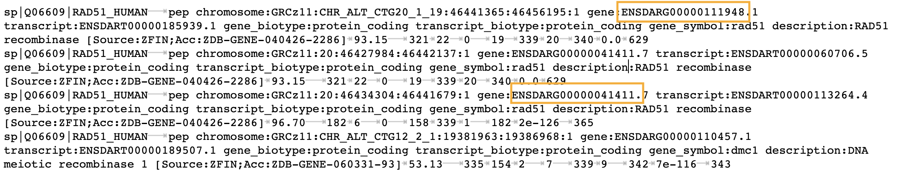

## Breakout Rooms Challenge

### Reproducing `DESeq2` steps

Starting from `guided-tutorial/deseq-tutorial.ipynb`, use `tximport` to read in the `Salmon` output present in the transcriptomics repository. 

Using the functions provided by `DESeq2`, go through the process of reading in the `Salmon` data using `tximport` processes to a `DESeq2` object, and then run differential expression. 

Try plotting the expression of the most significantly differentially expressed genes between treatments, following the scaffold provided from the existing cells in the `DESeq2` tutorial. 

### BLAST search

If there is time, you can create a BLAST database using

```
makeblastdb -in ../../complete-sequence-data/Danio_rerio.GRCz11.pep.all.fa -out ../../blast-out/zebrafish_db.fasta -dbtype prot -parse_seqids -title daniorerio
```

And then we want to `BLAST` for a gene of interest, in this case the amino acid sequence for Rad51.

```
blastp -query rad51.faa -db zebrafish_db.fasta -evalue 1e-10 -num_threads 4 -outfmt "6 qseqid salltitles pident length mismatch gapopen qstart qend sstart send evalue bitscore" -out zebrafish_rad51.txt
```

- Make sure that the paths are correct - for me I had to run `blastp -query ../breakout-rooms/rad51.faa -db ../../blast-out/zebrafish_db.fasta -evalue 1e-10 -num_threads 4 -outfmt "6 qseqid salltitles pident length mismatch gapopen qstart qend sstart send evalue bitscore" -out zebrafish_rad51.txt` inside the `code` directory.

Now you can inspect the file `zebrafish_rad51.txt` in the current directory for `BLAST` matches to the Zebrafish database. 

The matches are ordered by **bitscore**. This is the last column in the tab-delimited file. The third field is the **percent identity** match, which is a secondary way of assessing the quality of the match.

### Integrating ID'd genes into differential expression

Armed with these hits from the `BLAST` process, we can check out whether the associated genes are differentially expressed in the `DESeq2` results. 

 

Look for genes that have significant homology to the Rad51 gene. (If you're short on time, check for "ENSDART00000131273" in the tx2gene file). 
